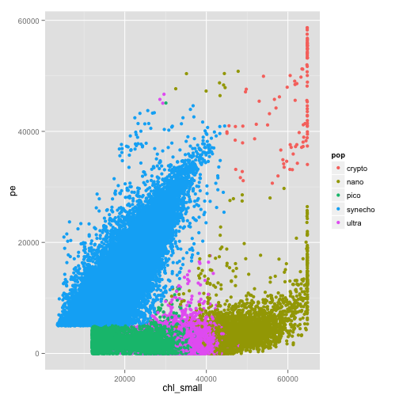
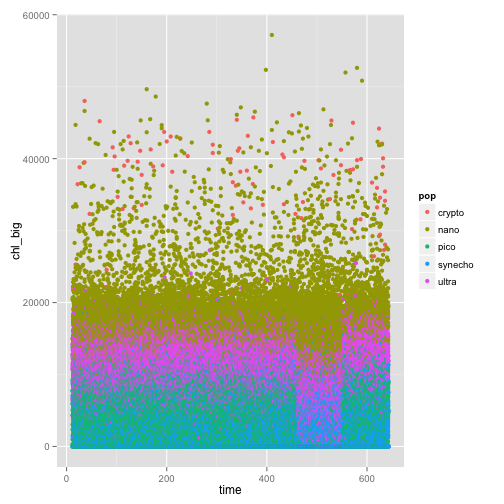

```r
# read the dataset
df <- read.csv("seaflow_21min.csv")

#Q1
summary(df$pop)
```

```
##  crypto    nano    pico synecho   ultra 
##     102   12698   20860   18146   20537
```

```r
#Q2
summary(df$fsc_small)
```

```
##    Min. 1st Qu.  Median    Mean 3rd Qu.    Max. 
##   10000   31300   35500   34900   39200   65400
```

```r
#Q3
library(caret)
set.seed(3456)
trainIndex <- createDataPartition(df$pop, p = .5, list = FALSE, times = 1)
dfTrain <- df[ trainIndex, ]
dfTest <- df[ -trainIndex, ]
summary(dfTrain$time)
```

```
##    Min. 1st Qu.  Median    Mean 3rd Qu.    Max. 
##      12     176     360     342     502     643
```

```r
#Q4
library(ggplot2)
p <- ggplot(df, aes(x = chl_small, y = pe, colour = pop))
p + geom_point()
```

 

```r
#Q5-14
fol <- formula(pop ~ fsc_small + fsc_perp + chl_small + pe + chl_big + chl_small)

#Q5-7
library(rpart)
model_decision_tree <- rpart(fol, method="class", data=dfTrain)
print(model_decision_tree)
```

```
## n= 36172 
## 
## node), split, n, loss, yval, (yprob)
##       * denotes terminal node
## 
##  1) root 36172 25740 pico (0.0014 0.18 0.29 0.25 0.28)  
##    2) pe< 5006 26335 15950 pico (0 0.22 0.39 7.6e-05 0.38)  
##      4) chl_small< 3.213e+04 11358  1934 pico (0 0.00018 0.83 0.00018 0.17) *
##      5) chl_small>=3.213e+04 14977  6789 ultra (0 0.39 0.064 0 0.55)  
##       10) chl_small>=4.137e+04 5094   625 nano (0 0.88 0 0 0.12) *
##       11) chl_small< 4.137e+04 9883  2320 ultra (0 0.14 0.097 0 0.77) *
##    3) pe>=5006 9837   766 synecho (0.0052 0.053 0.0046 0.92 0.015)  
##      6) chl_small>=3.878e+04 614   114 nano (0.083 0.81 0 0.044 0.059) *
##      7) chl_small< 3.878e+04 9223   179 synecho (0 0.0021 0.0049 0.98 0.012) *
```

```r
printcp(model_decision_tree)
```

```
## 
## Classification tree:
## rpart(formula = fol, data = dfTrain, method = "class")
## 
## Variables actually used in tree construction:
## [1] chl_small pe       
## 
## Root node error: 25742/36172 = 0.71
## 
## n= 36172 
## 
##      CP nsplit rel error xerror   xstd
## 1 0.351      0      1.00   1.00 0.0033
## 2 0.281      1      0.65   0.65 0.0037
## 3 0.149      2      0.37   0.37 0.0033
## 4 0.018      3      0.22   0.22 0.0027
## 5 0.010      4      0.20   0.20 0.0026
```

```r
#Q8
predicted_decision_tree <- predict(model_decision_tree, type="class", newdata=dfTest)
accuracy <- sum(predicted_decision_tree == dfTest$pop)/nrow(dfTest)
print(accuracy)
```

```
## [1] 0.8563
```

```r
#Q9
library(randomForest)
```

```
## randomForest 4.6-10
## Type rfNews() to see new features/changes/bug fixes.
```

```r
model_random_forest <- randomForest(fol, data=dfTrain)
print(model_random_forest)
```

```
## 
## Call:
##  randomForest(formula = fol, data = dfTrain) 
##                Type of random forest: classification
##                      Number of trees: 500
## No. of variables tried at each split: 2
## 
##         OOB estimate of  error rate: 7.91%
## Confusion matrix:
##         crypto nano  pico synecho ultra class.error
## crypto      49    1     0       1     0   0.0392157
## nano         1 5592     0       3   753   0.1192314
## pico         0    0 10080       8   342   0.0335570
## synecho      0    2     1    9070     0   0.0003307
## ultra        0  351  1389       9  8520   0.1703184
```

```r
predicted_random_forest <- predict(model_random_forest, type="class", newdata=dfTest)
accuracy <- sum(predicted_random_forest == dfTest$pop)/nrow(dfTest)
print(accuracy)
```

```
## [1] 0.9202
```

```r
#Q10
importance(model_random_forest)
```

```
##           MeanDecreaseGini
## fsc_small             2674
## fsc_perp              1857
## chl_small             8441
## pe                    9079
## chl_big               4806
```

```r
#Q11
library(e1071)
model_svm <- svm(fol, data=dfTrain)
print(model_svm)
```

```
## 
## Call:
## svm(formula = fol, data = dfTrain)
## 
## 
## Parameters:
##    SVM-Type:  C-classification 
##  SVM-Kernel:  radial 
##        cost:  1 
##       gamma:  0.2 
## 
## Number of Support Vectors:  8835
```

```r
predicted_svm <- predict(model_svm, type="class", newdata=dfTest)
accuracy <- sum(predicted_svm == dfTest$pop)/nrow(dfTest)
print(accuracy)
```

```
## [1] 0.9203
```

```r
#Q12
table_dt <- table(pred = predicted_decision_tree, true = dfTest$pop)
table_rf <- table(pred = predicted_random_forest, true = dfTest$pop)
table_svm <- table(pred = predicted_svm, true = dfTest$pop)
table_dt
```

```
##          true
## pred      crypto nano pico synecho ultra
##   crypto       0    0    0       0     0
##   nano        51 4990    1      35   663
##   pico         0    2 9368       3  1919
##   synecho      0   20   47    9035   104
##   ultra        0 1337 1014       0  7582
```

```r
table_rf
```

```
##          true
## pred      crypto  nano  pico synecho ultra
##   crypto      51     2     0       2     0
##   nano         0  5545     0       3   342
##   pico         0     0 10065       0  1363
##   synecho      0     2     7    9068     7
##   ultra        0   800   358       0  8556
```

```r
table_svm
```

```
##          true
## pred      crypto  nano  pico synecho ultra
##   crypto      50     3     0       2     0
##   nano         0  5602     0       3   396
##   pico         0     0 10080      23  1352
##   synecho      1     2    54    9043     8
##   ultra        0   742   296       2  8512
```

```r
#Q13
table(df$fsc_big)
```

```
## 
## 32384 32400 32416 32432 32448 32464 
##  2222 46429 21482  2080   127     3
```

```r
#Q14
library(ggplot2)
p <- ggplot(df, aes(x = time, y = chl_big, colour = pop))
p + geom_point()
```

 

```r
dfn <- df[df$file_id != 208, ]
set.seed(3456)
trainIndex <- createDataPartition(dfn$time, p = .5, list = FALSE, times = 1)
dfTrain <- dfn[ trainIndex, ]
dfTest <- dfn[ -trainIndex, ]

fol <- formula(pop ~ fsc_small + fsc_perp + chl_small + pe + chl_big + chl_small)

library(rpart)
model_decision_tree <- rpart(fol, method="class", data=dfTrain)
predicted_decision_tree <- predict(model_decision_tree, type="class", newdata=dfTest)
accuracy <- sum(predicted_decision_tree == dfTest$pop)/nrow(dfTest)
print(accuracy)
```

```
## [1] 0.894
```

```r
library(randomForest)
model_random_forest <- randomForest(fol, data=dfTrain)
predicted_random_forest <- predict(model_random_forest, type="class", newdata=dfTest)
accuracy <- sum(predicted_random_forest == dfTest$pop)/nrow(dfTest)
print(accuracy)
```

```
## [1] 0.9699
```

```r
library(e1071)
model_svm <- svm(fol, data=dfTrain)
predicted_svm <- predict(model_svm, type="class", newdata=dfTest)
accuracy <- sum(predicted_svm == dfTest$pop)/nrow(dfTest)
print(accuracy)
```

```
## [1] 0.9727
```

